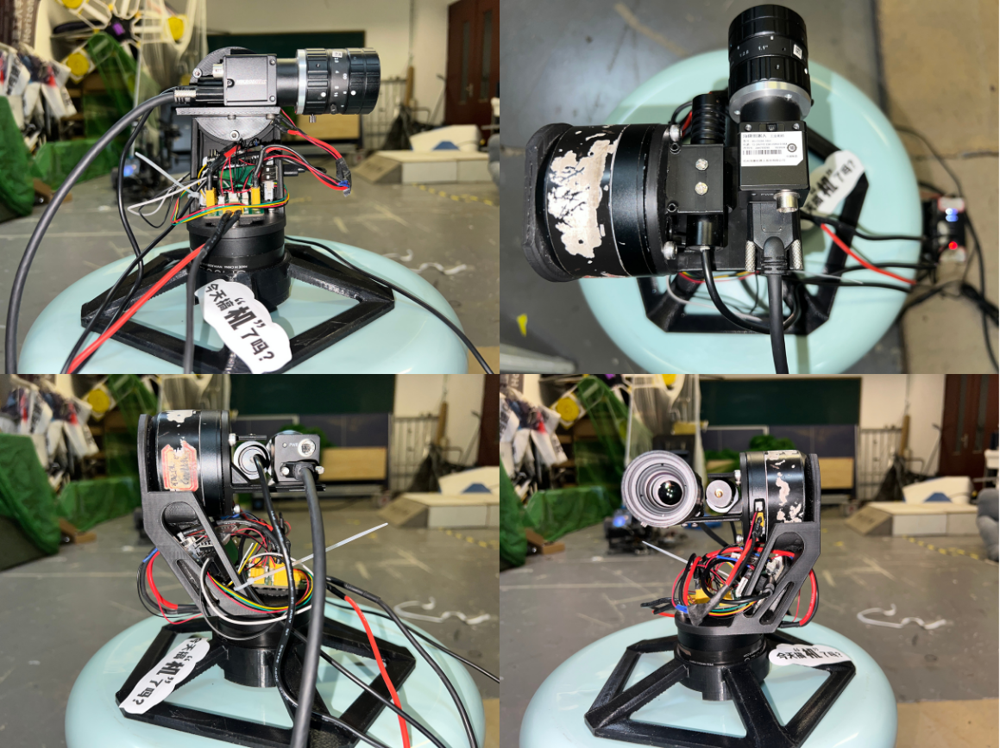
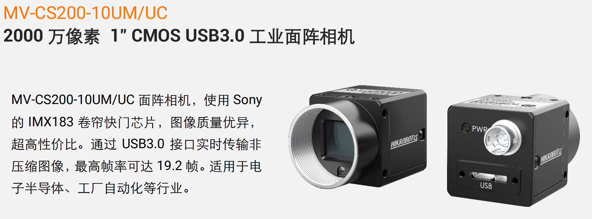
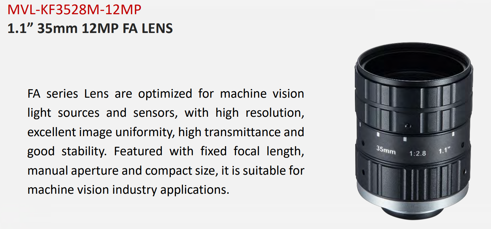
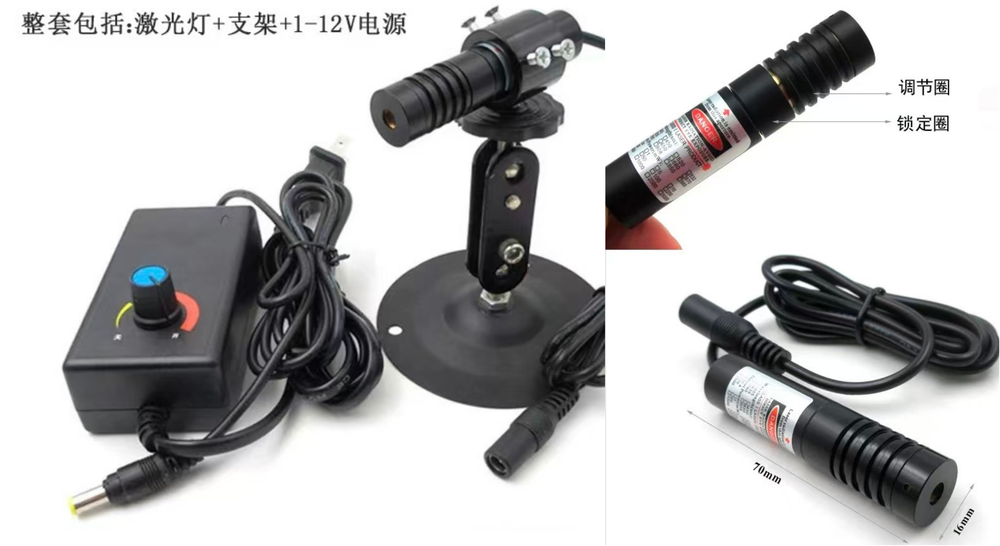
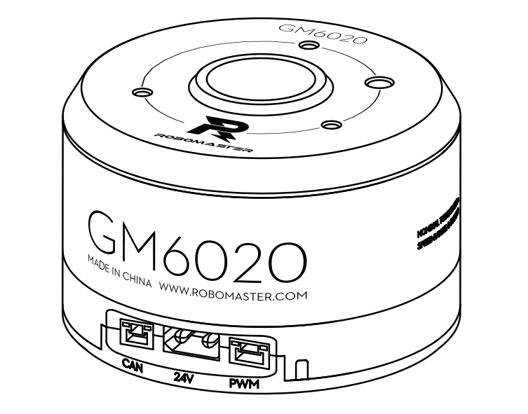
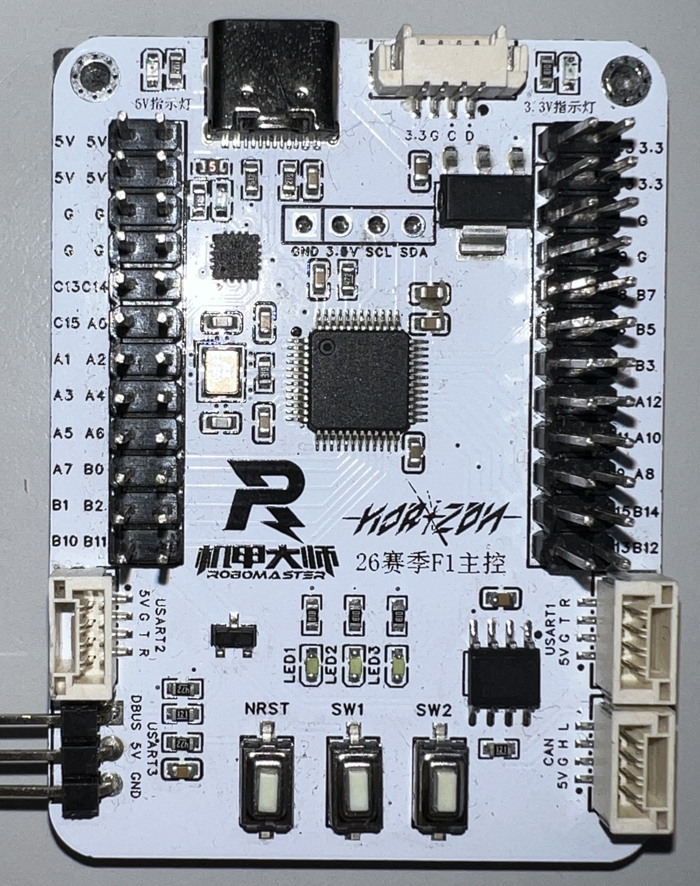

# LaserTracking

<p align="center">
  
</p>

- **ROBOMASTER 2026 华北理工大学 HORIZON战队 雷达组 反无人机激光追踪系统视觉部分 先行开源**
- **电控部分 [二轴云台控制开源](https://github.com/NCST-Horizon-RM/Horizon_frame_f1)**

---
## 概览

- `common`：统一数据结构与配置读取接口（`TargetMeasurement` / `GimbalState` / `GimbalCommand` / `CameraModel` / `Boresight`）。
- `hik_camera`：海康 MVS 相机驱动，支持 CPU/GPU 去马赛克与零拷贝。专为高性能推理引擎设计
- `detector`：目标检测（传统视觉或 TRT），输出 `TargetMeasurement`。（*后续根据比赛需要替换检测模型,现为测试 Demo*）
- `control`：**控制核心** 像素误差 → 云台角度指令，包含丢失目标搜索策略。
- `gimbal_serial`：串口收发云台状态与指令。
- `tool/boresight_calibrator`：同轴校准工具（生成 `u_L/v_L`）。
- `tool/parallax_estimator`：视差距离估算工具。
---
## Demo实际效果

<p align="center">
  
  <br>
  <em>Demo : Search & Tracking</em>
</p>

**注：实际测试认为使用高帧率工业相机最佳，CS200虽分辨率高但帧率过低导致新数据刷新速度不够快，具体表现为追踪有明显延迟**

## 工程结构

```
LaserTracking/
├── README.md
├── docs
└── src/
    ├── CMakeLists.txt            # 顶层构建入口
    ├── common/                   # 共享类型与配置读取
    ├── control/                  # 控制器与系统串联 demo
    ├── detector/                 # 传统视觉/ TRT 检测
    ├── gimbal_serial/            # 云台串口收发
    ├── hik_camera/               # 海康相机驱动
    ├── tool/
    │   ├── parallax_estimator/   # 视差估算工具
    │   └── boresight_calibrator/ # 同轴校准工具
    └── log/                      # 运行日志
```

## 依赖与环境

- OS：Ubuntu 22.04（推荐）
- OpenCV：4.x
- CUDA / TensorRT：可选（TRT 检测与 GPU Pipeline）
- 海康 MVS SDK：用于 `hik_camera`（`-DMVS_ROOT=/opt/MVS`）

### 测试设备

- Computer: Lenovo Legion Y9000P IAH7H
- CPU: 12th Gen Intel Core i9-12900H
- GPU: NVIDIA GA106M (GeForce RTX 3060 Mobile / Max-Q)
- OS: Ubuntu 22.04.5 LTS
- CUDA: 13.0 (nvcc 13.0.48, Driver 580.95.05, CUDA runtime 13.0)
- TensorRT: 10.14.1 (system packages, libnvinfer/libnvinfer_plugin)
- OpenCV: 4.5.4 (system), 4.12.0 (conda/python)


## 构建

```bash
cd /home/XXX/LaserTracking/src
mkdir -p build
cd build
cmake ..
make -j$(nproc)
```

构建后可执行文件位于各子目录：

- `src/build/control/control_system_demo`
- `src/build/detector/detector_demo`
- `src/build/hik_camera/hik_camera_demo`
- `src/build/gimbal_serial/gimbal_serial_demo`
- `src/build/tool/boresight_calibrator/boresight_calibrator`

## 运行系统（控制串联）

```bash
cd /home/XXX/LaserTracking/src/build/control
./control_system_demo \
  --camera-config ../../hik_camera/config/config.yaml \
  --detector-config ../../detector/config/detector.yaml \
  --control-config ../../control/config/control.yaml \
  --port /dev/ttyACM0 \
  --baud 115200 \
  --send-hz 400
```

## 日志

`control_system_demo` 会自动将终端输出追加写入：

```
src/log/log.txt
```

每次启动会在日志中追加空行与时间戳。

## 同轴校准（boresight）

### 使用工具

```bash
cd /home/XXX/LaserTracking/src/build/tool/boresight_calibrator
./boresight_calibrator \
  --camera-config ../../hik_camera/config/config.yaml \
  --detector-config ../../detector/config/detector.yaml \
  --boresight-config ../../control/config/control.yaml \
  --boresight-out ./boresight.yaml
```

### 校准流程

1) 固定目标，让检测框稳定。  
2) 调整红色十字到激光点位置。  
3) 保存 `u_L/v_L` 并写回 `control.yaml`。

注意：`u_L/v_L` 对距离敏感，建议在常用工作距离进行校准。

## 关键配置

- `src/control/config/control.yaml`：控制参数与 `u_L/v_L`。
- `src/detector/config/detector.yaml`：检测后端选择与参数。
- `src/hik_camera/config/config.yaml`：相机参数与去马赛克设置。

## 常见问题

- **可执行文件找不到**：顶层构建后位于 `src/build/<module>/` 子目录。
- **串口打不开**：确认设备名与权限（如 `/dev/ttyACM0`）。
- **没有检测目标**：检查 detector 配置、光照、目标颜色与相机曝光。


## 硬件清单

以下为激光追踪系统参考实现所使用的硬件配置。

<div align="center" style="display:flex; justify-content:center; align-items:center; gap:0;">
  
  
</div>
<div align="center">
  <em>Hardware overview</em>
</div>

---

### 工业相机与激光发射器

- **工业相机：** 海康威视 **MV-CS200-10UMUC**（USB3.0）
>[!TIP]
> **实际测试认为使用高帧率工业相机最佳**
>
>**CS200虽分辨率高但帧率过低导致新数据刷新速度不够快，具体表现为追踪有明显延迟**

- **镜头：** **MVL-KF3528M-12MP**（35 mm，1200 万像素）
- **激光模块：** 工业级可见光激光器
  - **波长范围：** 635 / 637 / 650 / 660 / 685 nm（可调）
  - **光型：** 圆点 / 一字线 / 十字线（按型号选择）
  - **参考购买链接（淘宝）：**  
    [https://e.tb.cn/h.7QN5h7J5SnyD6B5](https://e.tb.cn/h.7QN5h7J5SnyD6B5?tk=bmXiUX9Tbjg )

<p align="center">
  
  <br>
  <em>Hikvision MV-CS200-10UMUC (USB3.0)</em>
</p>

<p align="center">
  
  <br>
  <em>MVL-KF3528M-12MP (35mm, 12MP)</em>
</p>

<p align="center">
  
  <br>
  <em>Visible laser module (reference model)</em>
</p>

---

### 控制与执行

- **云台：** 两轴云台（Pan-Tilt）
- **电机：** **GM6020**（示例型号）
- **微控制器（MCU）：** **STM32F103C8T6**（用于底层控制与串口通信）

<table align="center">
  <tr>
    <td align="center" valign="middle">
      <br>
      <em>GM6020 motor (example)</em>
    </td>
    <td align="center" valign="middle">
      <br>
      <em>STM32F103C8T6 MCU</em>
    </td>
  </tr>
</table>


---

### 运算平台

- **主机平台：** x86_64 架构 Linux 主机
- **GPU：** NVIDIA RTX 系列显卡（可选，用于 CUDA / TensorRT 加速）
- **接口：** USB 3.0（相机），UART（云台控制）

---

### 通信接口

- **相机接口：** USB 3.0
- **云台通信：** 串口（UART）

---

### 供电

- **相机供电：** USB 供电
- **云台与激光供电：** TB48S 电池

---

### 说明

- 实际可达到的帧率受 USB 3.0 链路带宽与相机分辨率限制。
- GPU 加速并非必需，但在高帧率检测与闭环控制中强烈推荐使用。
- 激光模块为**参考型号**，可根据功率、波长及光型需求替换为等效产品。


---

## 许可证

仓库内包含 AGPL-3.0 声明。

---

<p align="center">
  
</p>


<div align="center">
Copyright © 2026 ROBOMASTER · 华北理工大学 HORIZON 战队 · 雷达组 - YAOYUZHUO<br/>
Licensed under the GNU Affero General Public License v3.0 (AGPL-3.0).<br/>
Use, modification, and redistribution are permitted under the terms of AGPL-3.0.<br/>
The complete corresponding source must be made available.<br/>
2026 年 01 月 09 日

</div>
